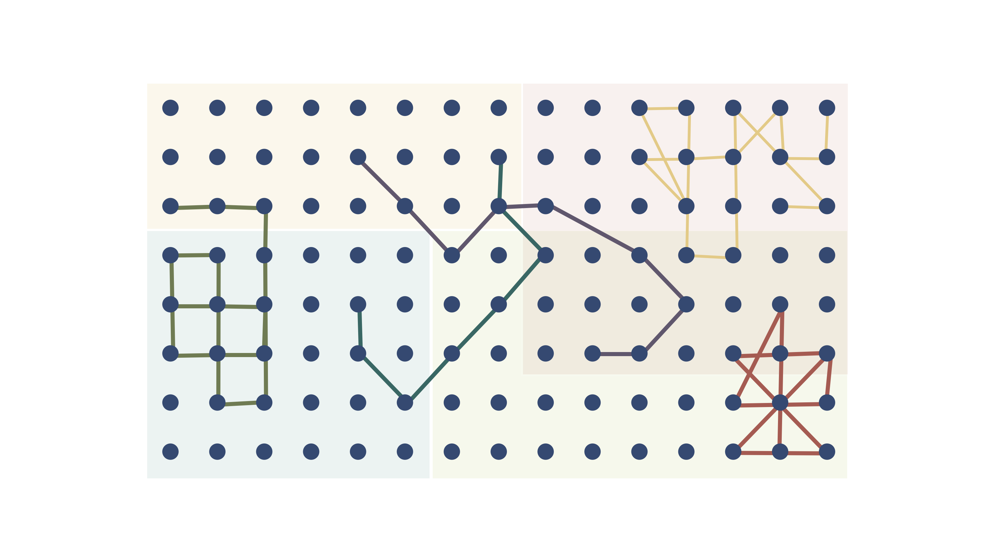
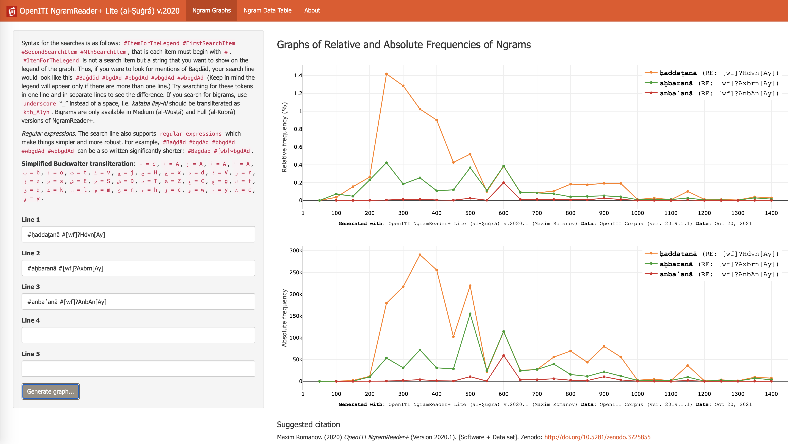
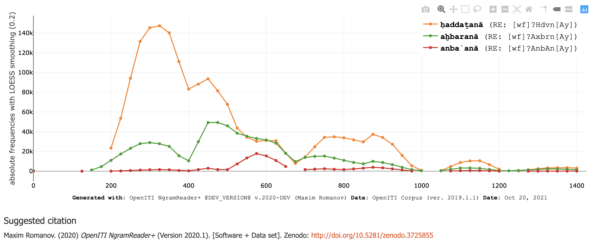
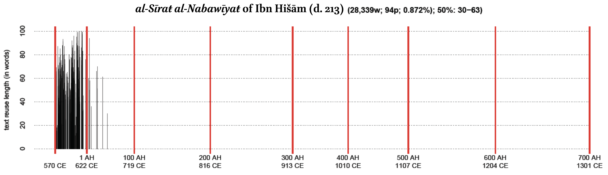
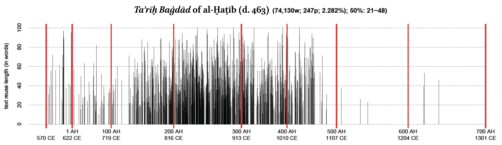
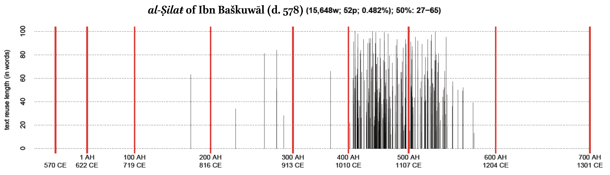
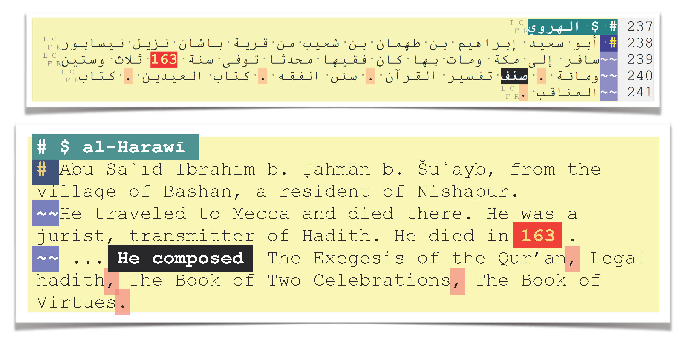
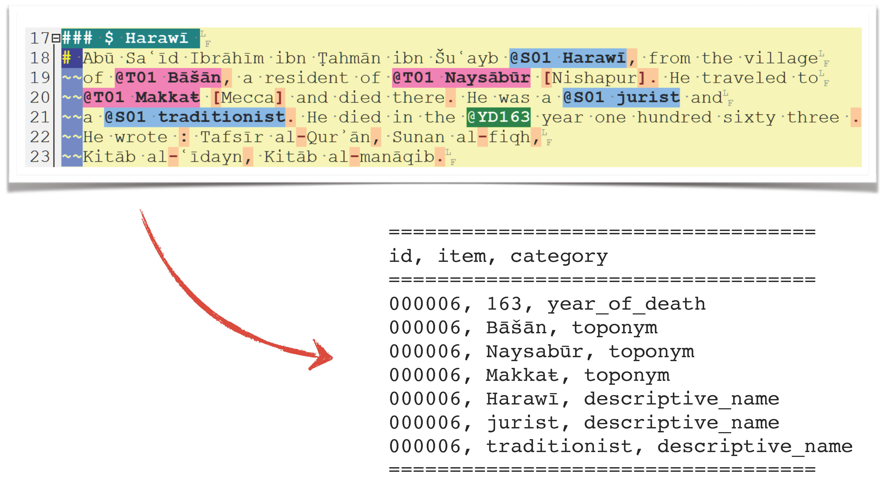
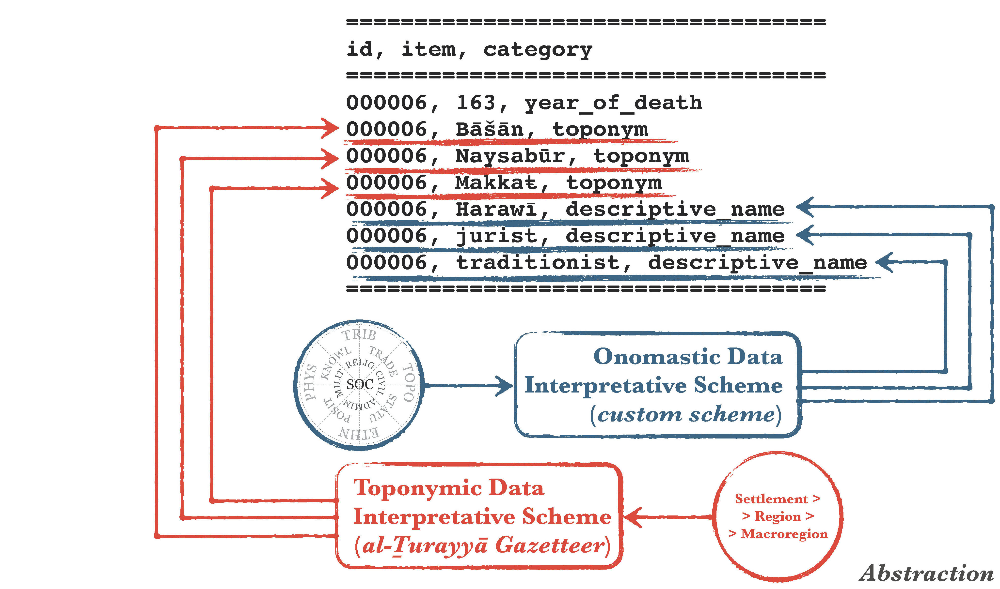
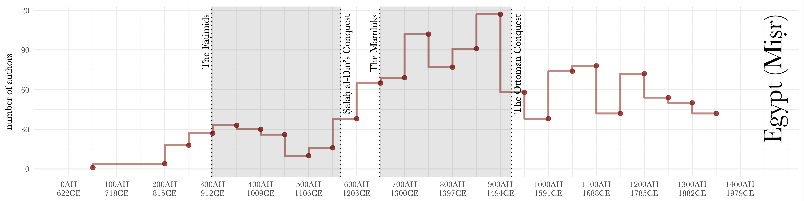

background-image: url(./images/bg_DHcongress_2021.jpg)
background-size: contain
class: center, middle

---
background-image: url(./images/bg_default_2021_eis.png)
background-size: contain
class: center, middle

# OpenITI

## *The Corpus for The Field*

⥈

**Maxim Romanov**

Emmy Noether Junior Research Group Leader

*The Evolution of Islamic Societies (c.600-1600 CE): 
Algorithmic Analysis into Social History*

Universität Hamburg

⥈

October 20, 2021

   

---
# Library Vs. Corpus

.large[- **Libraries**
	- *al-Maktabaŧ al-Šāmilaŧ* (<https://www.shamela.ws/>)
	- *al-Jāmiʿ al-Kabīr* (HDD, *al-Turāṯ*)
	- *Maktabaŧ al-Šīʿaŧ* (<http://shiaonlinelibrary.com/>)
	- *Kitābḫāna-yi Dījītāl-i Nūr* (<https://www.noorlib.ir/>)
	- *and quite a few others*...]

---
# Why would we need a corpus?

.large[- **Corpus?**
	- Why would we need a corpus, not to mention **the** corpus?

	- (**The** corpus may sound presumptious, but it is necessary)]

---
# Library Vs. Corpus

- When we have simply texts, there are no connections among them.

---
# Library Vs. Corpus

- Collecting them into libraries allows us to organize them into categories, *imposing* static relationships among texts.

---
# Library Vs. Corpus

- Organizing texts into a corpus gives us a mechanism:
	- [1] to establish new connections among texts computationally;

---
# Library Vs. Corpus

- Organizing texts into a corpus gives us a mechanism:
	- [2] to model the entire written tradition;

---
# Library Vs. Corpus

- Most importantly:
	- [3] a single massive corpus will allow us to do this better than through a number of smaller unconnected corpora;

---

# Library Vs. Corpus

- **Corpus**

	- *Open Islamicate Texts Initiative* (*OpenITI*)

		- *website*: <https://openiti.org/>

		- *corpus*: <https://github.com/OpenITI>
			- LATEST RELEASE: Lorenz Nigst, Maxim Romanov, Sarah Bowen Savant, Masoumeh Seydi, & Peter Verkinderen. (October 18, 2021). *OpenITI: a Machine-Readable Corpus of Islamicate Texts (Version 2021.2.5)* [Data set]. Zenodo. 

			- *General Statistics:*
			- ±2,650 unique authors
			- ±6,400 unique texts
			- over 1 billion tokens (2 billion tokens with all versions of texts)

		- **NB:** started as *OpenArabic* under the patronage of Dr. Gregory Crane (at Perseus Digital Library and Leipzig U)

---
# *OpenITI: co-PIs*

---
# *OpenITI: KITAB Project*

---
# *OpenITI: Simple, but Not Simpler*

---
background-image: url(./images/OpenITI_corpus07.36.png)
background-size: contain
class: center, middle

???

---
background-image: url(./images/OpenITI_corpus07.52.png)
background-size: contain
class: center, middle

???
---
background-image: url(./images/OpenITI_corpus08.02.png)
background-size: contain
class: center, middle

???
---
background-image: url(./images/OpenITI_corpus08.06.png)
background-size: contain
class: center, middle

???
---
background-image: url(./images/OpenITI_corpus08.09.png)
background-size: contain
class: center, middle

???
---
background-image: url(./images/OpenITI_corpus08.12.png)
background-size: contain
class: center, middle

???

---
background-image: url(./images/OpenITI_corpus08.14.png)
background-size: contain
class: center, middle

???

---
background-image: url(./images/OpenITI_corpus08.17.png)
background-size: contain
class: center, middle

???

---
background-image: url(./images/OpenITI_corpus08.21.png)
background-size: contain
class: center, middle

???

---
background-image: url(./images/OpenITI_corpus08.39.png)
background-size: contain
class: center, middle

???

---
background-image: url(./images/OpenITI_corpus08.41.png)
background-size: contain
class: center, middle

???

---
background-image: url(./images/OpenITI_corpus08.44.png)
background-size: contain
class: center, middle

???

---
background-image: url(./images/OpenITI_corpus08.51.png)
background-size: contain
class: center, middle

???

---
background-image: url(./images/OpenITI_corpus09.01.png)
background-size: contain
class: center, middle

???

---
background-image: url(./images/OpenITI_corpus09.12.png)
background-size: contain
class: center, middle

???

---
background-image: url(./images/OpenITI_corpus10.13.png)
background-size: contain
class: center, middle

???

---
background-image: url(./images/OpenITI_corpus10.15.png)
background-size: contain
class: center, middle

???

---
background-image: url(./images/OpenITI_corpus10.21.png)
background-size: contain
class: center, middle

???

---
background-image: url(./images/OpenITI_corpus10.23.png)
background-size: contain
class: center, middle

???

---
background-image: url(./images/OpenITI_corpus10.30.png)
background-size: contain
class: center, middle

???

---
background-image: url(./images/OpenITI_corpus10.32.png)
background-size: contain
class: center, middle

???

---
background-image: url(./images/OpenITI_corpus10.35.png)
background-size: contain
class: center, middle

???

---
background-size: contain
class: center, middle

# *Some Examples of Current Work*

---
# OpenITI NgramReader

- <https://maximromanov.shinyapps.io/OpenITI_NgramReaderPlus_Lite/>

---
# OpenITI NgramReader

- <https://maximromanov.shinyapps.io/OpenITI_NgramReaderPlus_Lite/>

---

# Similarities: *Text Reuse (TR)*

---
# Similarities: TR - *passim*.red.bold[\*]

.footnote[.red.bold[\*]developed by David Smith, Northeastern University, USA] 

---

# Similarities: TR - *Taʾrīḫ al-islām*

---

# Similarities: TR - *Taʾrīḫ al-islām*

---

# Similarities: TR - *Taʾrīḫ al-islām*

---
class: center, middle

# Modeling: *Tradition through Text Reuse*

---
background-image: url(./images/02.jpg)
background-size: contain

---
background-image: url(./images/03.jpg)
background-size: contain

---
background-image: url(./images/04.jpg)
background-size: contain

---
background-image: url(./images/05.jpg)
background-size: contain

---
background-image: url(./images/06.jpg)
background-size: contain

---
class: center, middle

# Modeling: *Algorithmic Analysis (A2)*

## Ismāʿīl Bāšā al-Baġdādī (d. 1339/1920) and his *Hadiyyaṯ al-ʿārifīn* (“The Gift to the Knowledgeable”)

• **Data** • descriptive names (Ar. *nisbaŧ*) • places (toponyms) • dates • book titles • 

---

# Modeling: *A2 - Text-Mining*

---

# Modeling: *A2 - Text-Mining*

---
# Modeling: *A2 - Text-Mining*

---

# Modeling: *A2 - Text-Mining*

---

# Modeling: *A2 - Books*

---

# Modeling: *A2 - Regions*

---

# Modeling: *A2 - Regions*

---

# Modeling: *A2 - Regions*

---

# Modeling: *A2 - Regions*

---
background-image: url(./images/HA_Connections1100-1200_Period100.png)
background-size: contain

# Modeling: *A2 - Connections*

.footnote[The Iraqi-Iranian core in the twelfth century CE]

---
background-image: url(./images/HA_Connections1200-1300_Period100.png)
background-size: contain

# Modeling: *A2 - Connections*

.footnote[Massive migrations of the thirteenth century CE]

---
background-image: url(./images/HA_Connections1400-1500_Period100.png)
background-size: contain

# Modeling: *A2 - Connections*

.footnote[New Mamlūk core of the fourteenth and fifteenth centuries CE]

---
background-image: url(./images/HA_Connections1500-1600_Period100.png)
background-size: contain

# Modeling: *A2 - Connections*

.footnote[Reconfiguration of the sixteenth century CE]

---
background-image: url(./images/HA_Connections1700-1800_Period100.png)
background-size: contain

# Modeling: *A2 - Connections*

.footnote[The Turco-Arabic and Indo-Iranian cores in the eighteenth century]

---
background-size: contain
class: center, middle

# Thank you!