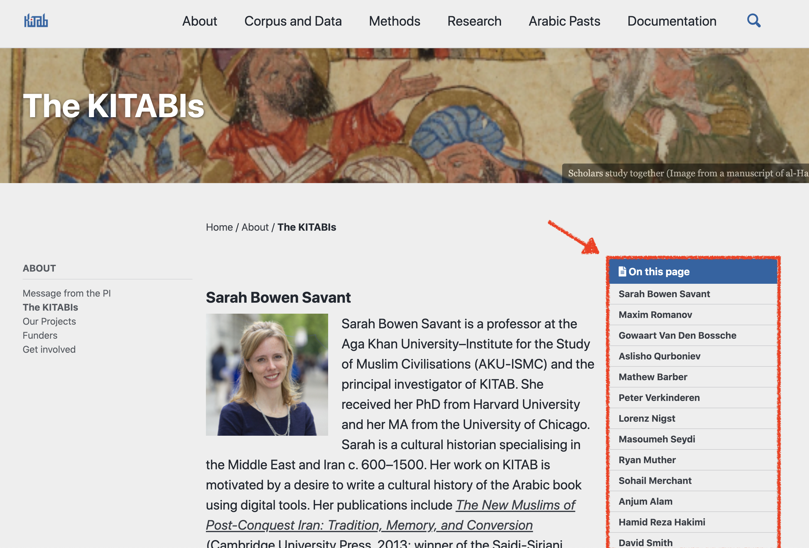
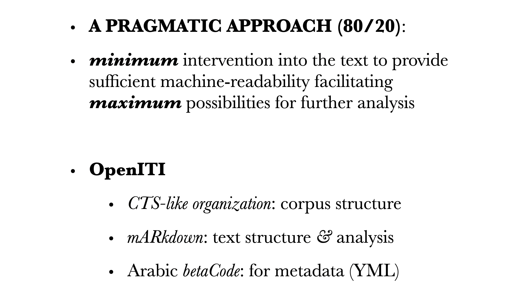

background-image: url(./images/bg_StabiWorkshop.jpg)
background-size: contain
class: center, middle

---
background-image: url(./images/bg_default_2021_eis.png)
background-size: contain
class: center, middle

# Being Pragmatic

## *Data and Authority Files in the OpenITI Corpus*

⥈

**Maxim Romanov**

Emmy Noether Junior Research Group Leader

*The Evolution of Islamic Societies (c.600-1600 CE): 
Algorithmic Analysis into Social History*

Universität Hamburg

⥈

October 28, 2021

   

---
# Library Vs. Corpus

.large[- **Libraries**
	- *al-Maktabaŧ al-Šāmilaŧ* (<https://www.shamela.ws/>)
	- *al-Jāmiʿ al-Kabīr* (HDD, *al-Turāṯ*)
	- *Maktabaŧ al-Šīʿaŧ* (<http://shiaonlinelibrary.com/>)
	- *Kitābḫāna-yi Dījītāl-i Nūr* (<https://www.noorlib.ir/>)
	- *and quite a few others*...]

---
# Why would we need a corpus?

.large[- **Corpus?**
	- Why would we need a corpus, not to mention **the** corpus?

	- (**The** corpus may sound presumptious, but it is necessary)]

---
# Library Vs. Corpus

- When we have simply texts, there are no connections among them.

---
# Library Vs. Corpus

- Collecting them into libraries allows us to organize them into categories, *imposing* static relationships among texts.

---
# Library Vs. Corpus

- Organizing texts into a corpus gives us a mechanism:
	- [1] to establish new connections among texts computationally;

---
# Library Vs. Corpus

- Organizing texts into a corpus gives us a mechanism:
	- [2] to model the entire written tradition;

---
# Library Vs. Corpus

- Most importantly:
	- [3] a single massive corpus will allow us to do this better than through a number of smaller unconnected corpora;

---

# Library Vs. Corpus

- **Corpus**

	- *Open Islamicate Texts Initiative* (*OpenITI*)

		- *website*: <https://openiti.org/>

		- *corpus*: <https://github.com/OpenITI>
			- LATEST RELEASE: Lorenz Nigst, Maxim Romanov, Sarah Bowen Savant, Masoumeh Seydi, & Peter Verkinderen. (October 18, 2021). *OpenITI: a Machine-Readable Corpus of Islamicate Texts (Version 2021.2.5)* [Data set]. Zenodo. 

			- *General Statistics:*
			- ±2,650 unique authors
			- ±6,400 unique texts
			- over 1 billion tokens (2 billion tokens with all versions of texts)

		- **NB:** started as *OpenArabic* under the patronage of Dr. Gregory Crane (at Perseus Digital Library and Leipzig U)

---
# *OpenITI: KITAB Project*

---
# *OpenITI: Simple, but Not Simpler*

---
# *OpenITI: Pragmatic Approach (1)*

.large[
- **Sustainability mantra**: 
*if you have to hire a professional to have essential work done, it is not exactly sustainable*

- **Solution**:
 *simplify technologies & increase digital literacy*
]

---
# *OpenITI: Pragmatic Approach (2)*

.large[
- **“As simple as possible, but no simpler”**:
  *maximum* efficiency
 &nbsp;&nbsp;&nbsp;&nbsp;with *minimum* technological variety
 &nbsp;&nbsp;&nbsp;&nbsp;with *minimum* manual effort
]

---
# *OpenITI: Pragmatic Approach (3)*

.large[

**OpenITI Basic Principles**:

- LOD *&* machine readability;
- corpus structure: *CTS-like organization*;
- structure *&* analysis: *OpenITI mARkdown*;
- metadata records: *Arabic betaCode*;
- metadata organization: *expandable YML files*;

]

---
# *OpenITI: Pragmatic Approach (4)*

.large[

**OpenITI**: a federated, machine-readable, flat-file database 

]

* FFDB: *relationships can be inferred from the data in the database, but the database format itself does not make those relationships explicit.*

---
background-image: url(./images/OpenITI_corpus07.36.png)
background-size: contain
class: center, middle

???

---
background-image: url(./images/OpenITI_corpus07.52.png)
background-size: contain
class: center, middle

???
---
background-image: url(./images/OpenITI_corpus08.02.png)
background-size: contain
class: center, middle

???
---
background-image: url(./images/OpenITI_corpus08.06.png)
background-size: contain
class: center, middle

???
---
background-image: url(./images/OpenITI_corpus08.09.png)
background-size: contain
class: center, middle

???
---
background-image: url(./images/OpenITI_corpus08.12.png)
background-size: contain
class: center, middle

???

---
background-image: url(./images/OpenITI_corpus08.14.png)
background-size: contain
class: center, middle

???

---
background-image: url(./images/OpenITI_corpus08.17.png)
background-size: contain
class: center, middle

???

---
background-image: url(./images/OpenITI_corpus08.21.png)
background-size: contain
class: center, middle

???

---
background-image: url(./images/OpenITI_corpus08.39a.png)
background-size: contain
class: center, middle

???

---
background-image: url(./images/OpenITI_corpus08.41.png)
background-size: contain
class: center, middle

???

---
background-image: url(./images/OpenITI_corpus08.44.png)
background-size: contain
class: center, middle

???

---
background-image: url(./images/OpenITI_corpus08.51.png)
background-size: contain
class: center, middle

???

---
background-image: url(./images/OpenITI_corpus09.01.png)
background-size: contain
class: center, middle

???

---
background-image: url(./images/OpenITI_corpus09.12.png)
background-size: contain
class: center, middle

???

---
background-image: url(./images/OpenITI_corpus10.13.png)
background-size: contain
class: center, middle

???

---
background-image: url(./images/OpenITI_corpus10.15.png)
background-size: contain
class: center, middle

???

---
background-image: url(./images/OpenITI_corpus10.21.png)
background-size: contain
class: center, middle

???

---
background-image: url(./images/OpenITI_corpus10.23.png)
background-size: contain
class: center, middle

???

---
background-image: url(./images/OpenITI_corpus10.30.png)
background-size: contain
class: center, middle

???

---
background-image: url(./images/OpenITI_corpus10.32.png)
background-size: contain
class: center, middle

???

---
background-image: url(./images/OpenITI_corpus10.32a.png)
background-size: contain
class: center, middle

???

---
background-image: url(./images/OpenITI_corpus10.32b.png)
background-size: contain
class: center, middle

???

---
background-image: url(./images/YML_01.04.05.jpg)
background-size: contain
class: center, middle

???
## YML Files: *Metadata*

---
background-image: url(./images/YML_01.04.06.jpg)
background-size: contain
class: center, middle

---
background-image: url(./images/YML_01.05.26.jpg)
background-size: contain
class: center, middle

---
background-image: url(./images/OnamasticonArabicum_22.54.54.jpg)
background-size: contain
class: center, middle

???
## Onomasticon

---
background-image: url(./images/OnamasticonArabicum_22.55.38.jpg)
background-size: contain
class: center, middle

???

---
background-image: url(./images/OnamasticonArabicum_22.55.55.jpg)
background-size: contain
class: center, middle

???

OnamasticonArabicum_22.56.09.jpg
OnamasticonArabicum_22.56.25.jpg

---

background-image: url(./images/YML_01.05.44.jpg)
background-size: contain
class: center, middle

---

background-image: url(./images/YML_01.06.00.jpg)
background-size: contain
class: center, middle

---

background-image: url(./images/YML_01.06.52.jpg)
background-size: contain
class: center, middle

---

background-image: url(./images/YML_01.07.05.jpg)
background-size: contain
class: center, middle

---

background-image: url(./images/YML_01.07.58.jpg)
background-size: contain
class: center, middle

---

background-image: url(./images/YML_01.08.12.jpg)
background-size: contain
class: center, middle

---

background-image: url(./images/YML_01.08.34.jpg)
background-size: contain
class: center, middle

---

background-image: url(./images/YML_01.08.50.jpg)
background-size: contain
class: center, middle

---
background-image: url(./images/metadata_app.png)
background-size: contain
class: center, bottom

<https://kitab-corpus-metadata.azurewebsites.net/>

???
## Metadata App

---
background-size: contain
class: center, middle

# Thank you!