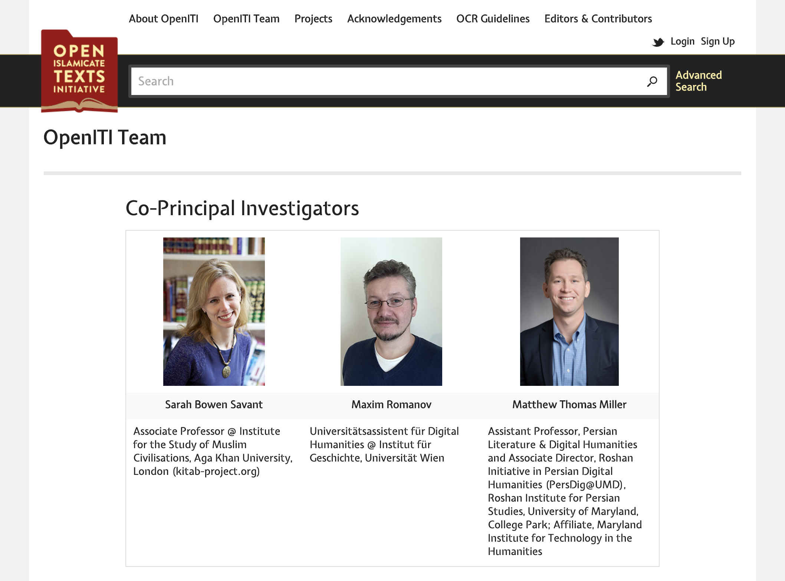
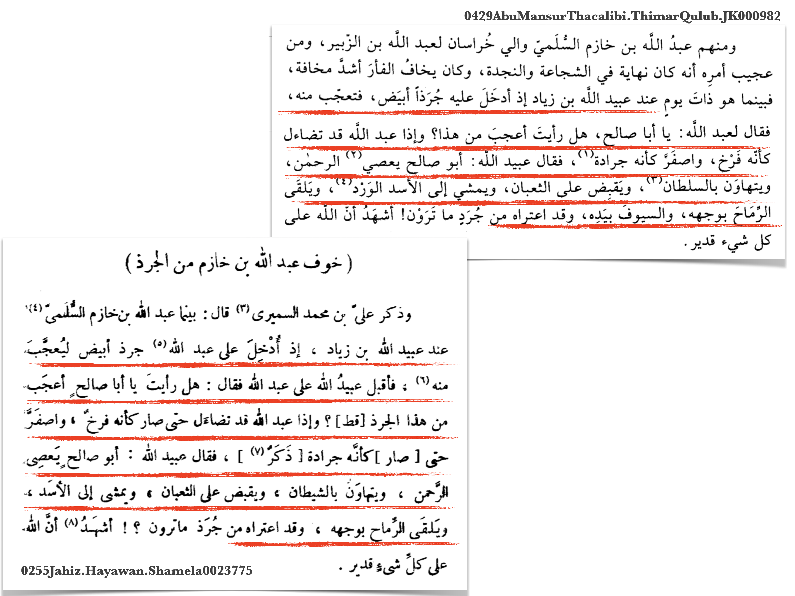
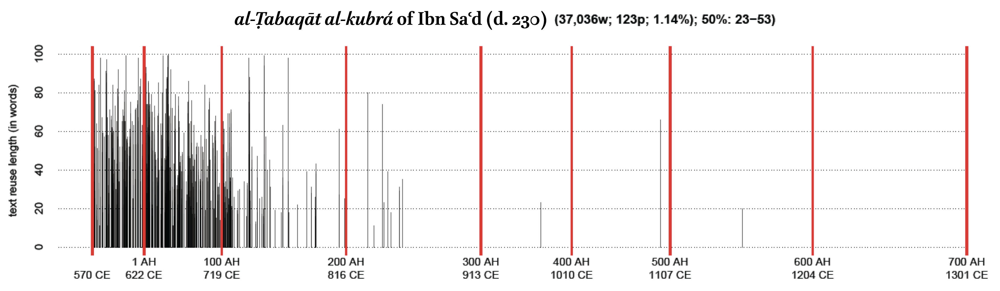
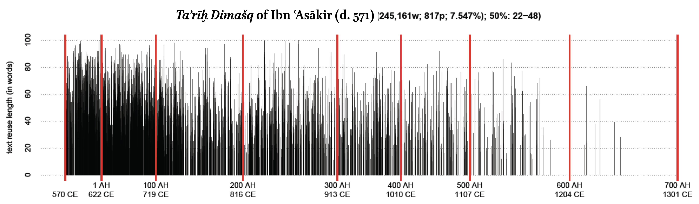
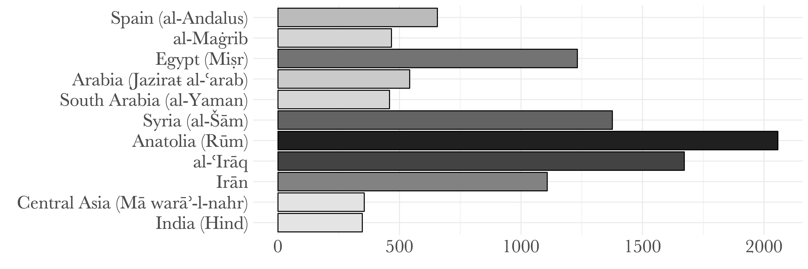

background-image: url(./images/DieJungeAcademie.png)
background-size: contain
class: center, bottom

# Digital Humanities for non-European Languages

## *The Case of Arabic*

⥈

Maxim Romanov

Department of History, U Vienna *&* KITAB Project, Aga Khan U–London

???
- presentation: <https://tinyurl.com/Romanov-DJA-Presentation>
- info on the workshop: <https://www.diejungeakademie.de/aktivitaeten/veranstaltungen-und-oeffentliche-auftritte/termin/event/calendar/workshop-hack-the-middle-east/view-list%7Cpage_id-8/2020/08/11/>

---
background-image: url(./images/DieJungeAcademie.png)
background-size: contain
class: center, bottom

# 1. Premises
# 2. Resources
# 3. Methods

---
background-image: url(./images/DieJungeAcademie.png)
background-size: contain
class: center, middle

# 1. Premises

---
# 1.1 Defining DH

.large[[**methodological exigency**] The transition to digital humanities must begin somewhere at the point where our humanistic inquiry starts to rely on the machine as the matter of methodological exigency. .red.bold[\*]]

.footnote[.red[\*] Romanov, Maxim G. “A Digital Humanities for Premodern Islamic History.” <i>International Journal of Middle East Studies</i> 50, no. 01 (February 2018): 129–34. <https://doi.org/10.1017/S0020743817001015>]

???
>> Defining digital humanities is tricky. Our scholarship has been intrinsically digital for quite a few decades already, as we rely more and more on electronic storage to save, word processors to write, bibliography managers to organize, databases to consult, digital libraries to search and read. Living in the digital world, however, does not make us all digital humanists—if these digital entities are taken away, we will have their analog prototypes to fall back on, and beyond a certain level of inconvenience, this will not affect the way most of us do our scholarship. The transition to digital humanities must begin somewhere at the point where our humanistic inquiry starts to rely on the machine as the matter of methodological exigency

---

# 1.1 Defining DH

.large[[**explicit modeling**] One should think of modeling, to quote Willard McCarty, as “a continual process of coming to know by manipulating representations.”.red.bold[\*]]

.footnote[.red[\*] See his “Modeling: A Study in Words and Meanings,” in Susan Schreibman, Ray Siemens, and John Unsworth, <i>A New Companion to Digital Humanities</i>, 2nd ed. (Chichester, UK, 2016); and, more extensively, Willard McCarty, <i>Humanities Computing</i> (Basingstoke, UK, 2014), 20–72.]

---

# 1.1 Defining DH

.large[[**abstractions**] Using a limited set of features (*proxies*) which in their interrelations are understood to represent some complex phenomenon.]

---

# 1.1 Defining DH

---

# 1.2 Why text-based DH?

--
- all data that we have on our computers can be represented as **texts**:

	- or, actually, **numbers**, which we can think of as a particular text format

--
- any set of objects we study has a textual component: **metadata**

	- most of metadata is made of text (i.e., *human readable descriptions*);

--
- what if objects that we study are not text or numbers?

	- we actually transform them into *abstractions* which are either **text** or **numbers**, or some in-between combination of both.

---

# 1.3 (Non-)?English-based DH

- the notion of **universal methods** seems to be coming from monolingual research environments

- none are completely language agnostic

- application of any method includes at least to main steps:

	1) data pre-processing, which is *always* language specific;

	2) an application of a method, which might be considered **universal**.

---

# 1.4 The Symbiosis of Resources *&* Methods

- more and more libraries

- easier and easier to use:

	- lots of libraries have been written that reduce the length of your own analytical scripts from low-hundreds of lines of code to “low-tens” of lines of code

--

- **Problem**

--
	- if you do not have relevant resources, the availability of great, powerful and easy-to-use.red.bold[*] methods will not matter.

.footnote[.red[*] — “easy-to-use” still requires some coding skills]

???
- A great variety of methods is now available and it is becoming easier and easier to use them: lots of libraries have been written that reduce the length of your own analytical scripts from low-hundreds of lines of code to “low-tens” of lines of code

---

# 1.5 On learning how to code:

- not that difficult:

	- lots of resources: <https://programminghistorian.org/>

---

# 1.5 On learning how to code:

- not that difficult:

	- lots of resources: <https://www.datacamp.com/>

---

# 1.5 On learning how to code:

- not that difficult:

	- lots of resources:
	
		- <https://www.datacamp.com/>
		- <https://programminghistorian.org/>
	
- if you have learned one, two, three or more natural languages, you can definitely learn a formal language

- just think about it as a language, because it is: it has grammar, syntax, vocabulary; the only difference: it is much easier, because it is *formal*

- you will be able to talk to a computer and ask it to do something for you

.footnote[.red[**NB:**] following *Marshall McLuhan*, each *medium* is an extension of our physical capacities or mental faculties. Computer is the most exciting medium so far: it can be instructed to extend our thinking, and it can do a lot of analytical work.]

---

# 1.5 On learning how to code:

- *ultimately*, do you really have to learn how to code?

--

	- **do you really need it?!**

	- hire those who can
	
	- use *packaged* tools

--

- *drawbacks*?

--
	- well, funding: programmers are expensive
	
	- like relying on translations in your research
	
--

- *important difference*: research code *vs.* development

---

class: center, middle

# 1.6 Questions so far?

---
background-image: url(./images/DieJungeAcademie.png)
background-size: contain
class: center, bottom

# 2 Resources

## • Corpus •

## • OCR •

## • NLP •

---
class: middle, center

# 2.1 Corpus

---

# 2.1 Library Vs. Corpus

- **Libraries**
	- *al-Maktabaŧ al-Šāmilaŧ* (<https://www.shamela.ws/>)
	- *al-Jāmiʿ al-Kabīr* (HDD, *al-Turāṯ*)
	- *Maktabaŧ al-Šīʿaŧ* (<http://shiaonlinelibrary.com/>)
	- *Kitābḫāna-yi Dījītāl-i Nūr* (<https://www.noorlib.ir/>)
	- *and quite a few others*...

- **Corpus**

	- *Open Islamicate Texts Initiative* (*OpenITI*)
		- *website*: <https://openiti.org/>
		- *corpus*: <https://github.com/OpenITI>
			- LATEST RELEASE: Lorenz Nigst, Maxim Romanov, Sarah Bowen Savant, Masoumeh Seydi, & Peter Verkinderen. (2020). *OpenITI: a Machine-Readable Corpus of Islamicate Texts (Version 2020.1.2)* [Data set]. Zenodo.  
		- **NB:** started as *OpenArabic* under the patronage of Dr. Gregory Crane (at Perseus Digital Library and Leipzig U)

---
# 2.2 *OpenITI: co-PIs*

---
# 2.2 *OpenITI: GitHub*

---
# 2.2 *OpenITI: URI Structure*

---
# 2.2 *OpenITI: Folder Structure*

---
# 2.2 *OpenITI: Coverage*

- Statistics:
	- *c.* 1800 authors
	- *c.* 4,300 unique titles (700 mln words)
	- *c.* 7,100 texts altogether (1,46 billion words)

???
*Chronological distribution of texts*. OpenArabic—an earlier instance of OpenITI—now constitutes 99% of the OpenITI Corpus. The graph above shows the chronological coverage of the OpenITI corpus, making it clear that pre-1500 period is covered more thoroughly.

---
# 2.2 *OpenITI: Releases*

- *ongoing work* (within the KITAB Project)
	- structural annotation
		- *OpenITI mARkdown*: <https://maximromanov.github.io/mARkdown/>
	- URI verification
	- metadata collection
		- metadata app: <https://kitab-corpus-metadata.azurewebsites.net/>
	- expansion:
		- scraping open Internet libraries
		- OCR-ing printed editions

- .red[LATEST RELEASE:] Lorenz Nigst, Maxim Romanov, Sarah Bowen Savant, Masoumeh Seydi, *&* Peter Verkinderen. (2020). *OpenITI: a Machine-Readable Corpus of Islamicate Texts (Version 2020.1.2)* [Data set]. Zenodo. 

---
class: center, middle

# 2.2 OCR

---
# 2.2 OCR

- .large[*optical character recognition*: a process of conversion of an image of a text into editable text]

- .large[*steps*]:

	- line segmentation

	- word segmentation

	- character segmentation

	- conversion into text

- .large[*Connected-Script Problem*]

???
- development for Latin script reached quite high accuracy (high 90%) and CS people lost interest, considering the problem solved

---

background-image: url(./images/OCR_1a.png)
background-size: contain

---

background-image: url(./images/OCR_2.png)
background-size: contain

---

background-image: url(./images/OCR_3.png)
background-size: contain

---

background-image: url(./images/OCR_4.png)
background-size: contain

---

background-image: url(./images/OCR_5.png)
background-size: contain

---

# 2.2 *Connected-Scripts Problem*

---

# 2.2 OCR: *Printed Books*

- *Connected-Script Problem*

- *different approach*: machine-learning (neural networks)

	- .large[*Kraken*.red.dot[*]]
	
		- “Kraken relies on a neural network—which mimics the way we learn—to recognize letters in the images of entire lines of text without attempting first to segment lines into words and then words into letters. This segmentation step—a mainstream OCR approach that persistently performs poorly on connected scripts—is thus completely removed from the process, making Kraken uniquely powerful for dealing with the diverse variety of ligatures in connected Arabic script”

	- Now also in: *Tesseract*, *Google OCR*

.footnote[.red.dot[*] Kiessling, Benjamin, Matthew Thomas Miller, Sarah Bowen Savant, and Maxim G. Romanov. “Important New Developments in Arabographic Optical Character Recognition (OCR).” <i>Al-ʿUṣūr al-Wusṭá (The Journal of Middle East Medievalists)</i> 25 (2017): 1–13.]

---
class: center
# 2.2 OCR: *Kraken*

---
class: center
# 2.2 OCR: *Kraken*

???
* *Kraken** offers an easy-to-train OCR solution for Arabic texts. The table above shows that we can reach the accuracy rates in the high nineties (95.88-99.68%) for a text—Ibn al-Faqīh’s *Kitāb al-Buldān*—for which training data is generated (about 1000 lines of text). The model will not necessarily work equally well for other texts—one can see that the worst results are for al-Jāḥiẓ’s *Kitāb al-Ḥayawān*, which happened to have a significantly different typeface. The table below shows that one can train a model for each specific typeface and achieve comparable rates in the high nineties (94.86-97.51%). Additionally, Kraken performs well on low-quality (200 dpi) pre-binarized images (#5 and #6 in the table above).*

---
class: center
# 2.2 OCR: *Kraken*

---

# 2.2 OCR: *Manuscripts*

- .large[Kiessling, Benjamin, Daniel Stökl Ben Ezra, and Matthew Thomas Miller. “BADAM: A Public Dataset for Baseline Detection in Arabic-Script Manuscripts.” In *Proceedings of the 5th International Workshop on Historical Document Imaging and Processing - HIP ’19*, 13–18. Sydney, NSW, Australia: ACM Press, 2019. <https://doi.org/10.1145/3352631.3352648>.]

---
class: center

---
class: center

---
class: center

---
class: center

---

# 2.2 OCR: *eScriptorium*

* PI: DANIEL STOEKL BEN EZRA
* Project: <https://escripta.hypotheses.org/>
* Videos: <https://escripta.hypotheses.org/escriptorium-video-gallery>
* Code: <https://gitlab.inria.fr/scripta/escriptorium>

---

# 2.2 OCR: *eScriptorium*

---

# 2.2 OCR: *eScriptorium*

---

# 2.2 OCR: *eScriptorium*

---
# 2.2 *OpenITI: AOCP*

---
layout: false

# 2.3 Arabic NLP

.left-column[
## Why do we need *natural language processing*?

English: *book(s)*

Arabic: ⟶
]
.right-column[

]

---

# 2.3 Arabic NLP

- pre-processing Arabic text:

	- reducing morphological complexity

		- tokenization

		- lemmatization

		- part-of-speech tagging
	
	- extracting syntactic information

		- subject, verb, object, etc.

	- named-entity recognition

		- persons, toponyms, concepts, etc.

---

# 2.3 Arabic NLP

- .red[*Madamira*] @ NYU—Abu Dhabi: <https://camel.abudhabi.nyu.edu/madamira/>

- .red[*Farasa*] @ Qatar Computing Research Institute: <http://qatsdemo.cloudapp.net/farasa/>

---
class: center

# 2.3 Arabic NLP: *Madamira*

---
class: center

# 2.3 Arabic NLP: *Madamira*

---
class: center

# 2.3 Arabic NLP: *Madamira*

---
class: center

# 2.3 Arabic NLP: *Madamira*

---
class: center

# 2.3 Arabic NLP: *Farasa*

.footnote[.red[*Farasa*] @ Qatar Computing Research Institute: <http://qatsdemo.cloudapp.net/farasa/>]

---
background-image: url(./images/DieJungeAcademie.png)
background-size: contain
class: center, middle

# 2.4 Questions?

---
background-image: url(./images/DieJungeAcademie.png)
background-size: contain
class: center, bottom

# 3 Methods

## • Similarities •

## • Modeling •

---
# 3.1 Similarities

.large[
.red[- topic modeling
- text reuse detection
- stylometry]
- and many other methods (*k-means clustering*, *hierarchical clustering*, *tf-idf*, etc.)
]

---
# 3.1 *Topic Modeling*

- biographies of women in al-Ḏahabī’s *Taʾrīḫ al-islām*

??? Topic #20 in al-Dhahabi’s “History” is on biographies of women. The topic is identified through the following shared tokens, most of which include feminine words, verbs in feminine forms, female pronouns, and prepositional phrases with feminine pronominal suffixes: (1) “daughter”; (2) “mother”; (3) “from-her”, i.e., [transmitted religious knowledge] “from her”; (4) “Fatima”, a female name; (5) “[she]-died”; (6) “to-her”; (7) “and-she”; (8) “[she] transmitted”; (9) “and-[she]-was”; (10) “and-[she]-died”; (11) “and-Fatima”, a female name; ... (14) “from-her” [the knowledge was transmitted]; (15) “sister”; (16) “pious” — feminine form; (17) “Zaynab”, a female name; (18) “and-[she]-listened”, i.e., she studied [with someone]; … and so on.

---

# 3.1 *Text Reuse (TR)*

---
# 3.1 TR: *passim*.red.bold[*]

.footnote[.red.bold[*]developed by David Smith, Northeastern University, USA] 

---

# 3.1 TR: *Taʾrīḫ al-islām*

---

# 3.1 TR: *Taʾrīḫ al-islām*

---

# 3.1 TR: *Taʾrīḫ al-islām*

---

# 3.1 TR: *Taʾrīḫ al-islām*

---
# 3.1 *Stylometry*

.large[Eder, Maciej, Jan Rybicki, and Mike Kestemont. “Stylometry with R: A Package for Computational Text Analysis.” *The R Journal* 8, no. 1 (August 2016): 107–121.]

---
# 3.1 *Stylometry*

---
background-image: url(./images/bct_colleagues_test_Consensus_600-800_MFWs_Culled_10-50_Classic_Delta_C_0.5_001_AI.png)
background-size: contain

---
background-image: url(./images/consensus_tree_hindawi_ai.png)
background-size: contain

---
background-image: url(./images/gephi_network_hindawi_ai.png)
background-size: contain

---

# 3.1 *Rolling Stylometry*

.footnote[Eder, Maciej. “Rolling Stylometry.” *Digital Scholarship in the Humanities* 31, no. 3 (September 1, 2016): 457–69. <https://doi.org/10.1093/llc/fqv010>.
]

---
background-image: url(./images/rs03.png)
background-size: contain

---

# 3.2 Modeling

.large[
- text reuse network (SNA)
- algorithmic analysis:
	- text-mining
	- social geography (SNA)
	- cultural production
]

---
class: center, middle

# 3.1 *Tradition through Text Reuse*

---
background-image: url(./images/02.jpg)
background-size: contain

---
background-image: url(./images/03.jpg)
background-size: contain

---
background-image: url(./images/04.jpg)
background-size: contain

---
background-image: url(./images/05.jpg)
background-size: contain

---
background-image: url(./images/06.jpg)
background-size: contain

---
class: center, middle

# 3.2 *Algorithmic Analysis (A2)*

## Ismāʿīl Bāšā al-Baġdādī (d. 1339/1920) and his *Hadiyyaṯ al-ʿārifīn* (“The Gift to the Knowledgeable”)

• **Data** • descriptive names (Ar. *nisbaŧ*) • places (toponyms) • dates • book titles • 

---

# 3.2 *A2: Text-Mining*

---

# 3.2 *A2: Text-Mining*

---
# 3.2 *A2: Text-Mining*

---

# 3.2 *A2: Text-Mining*

---

# 3.2 *A2: Books*

---

# 3.2 *A2: Regions*

---

# 3.2 *A2: Regions Over Time*

---

# 3.2 *A2: Regions Over Time*

---

# 3.2 *A2: Regions Over Time*

---
background-image: url(./images/HA_Connections1100-1200_Period100.png)
background-size: contain

# 3.2 *A2: Cultural Connections*

.footnote[The Iraqi-Iranian core in the twelfth century CE]

---
background-image: url(./images/HA_Connections1200-1300_Period100.png)
background-size: contain

# 3.2 *A2: Cultural Connections*

.footnote[Massive migrations of the thirteenth century CE]

---
background-image: url(./images/HA_Connections1400-1500_Period100.png)
background-size: contain

# 3.2 *A2: Cultural Connections*

.footnote[New Mamlūk core of the fourteenth and fifteenth centuries CE]

---
background-image: url(./images/HA_Connections1500-1600_Period100.png)
background-size: contain

# 3.2 *A2: Cultural Connections*

.footnote[Reconfiguration of the sixteenth century CE]

---
background-image: url(./images/HA_Connections1700-1800_Period100.png)
background-size: contain

# 3.2 *A2: Cultural Connections*

.footnote[The Turco-Arabic and Indo-Iranian cores in the eighteenth century]

---

background-image: url(./images/DieJungeAcademie.png)
background-size: contain
class: center, middle

# 3.3 Questions?

---

background-image: url(./images/DieJungeAcademie.png)
background-size: contain
class: center, middle

# Thank you!
