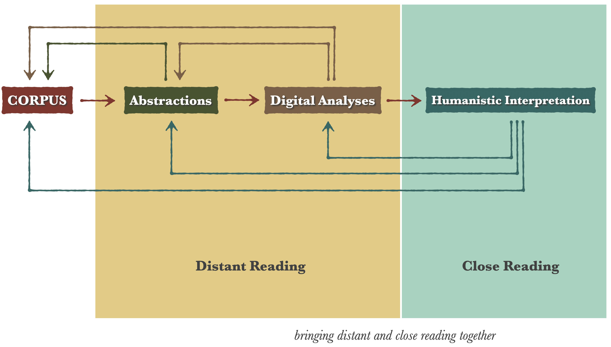
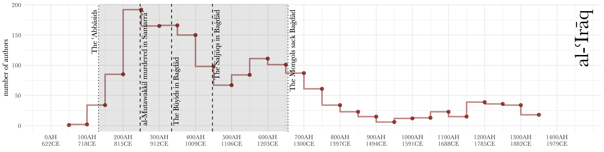
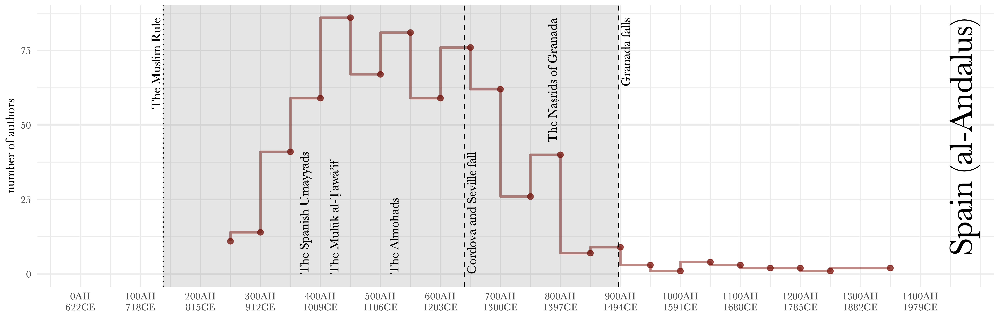

background-image: url(./images/bg_default_2021_eis.png)
background-size: contain
class: center, middle

# *Digital Humanities in Middle Eastern Studies*

## Introduction to Algorithmic Analysis

⥈

**Dr. Maxim Romanov**

Universität Hamburg

⥈

October 18, 2021

 
 

???
- разместить презентацию онлайн?

---
### Romanov, Maxim. 2017. “Algorithmic Analysis of Medieval Arabic Biographical Collections.” *Speculum* 92 (S1): S226–46. https://doi.org/10.1086/693970.

---
class: center, middle

# *Algorithhmic Analysis (A2)*

## Ismāʿīl Bāšā al-Baġdādī (d. 1339/1920) and his *Hadiyyaṯ al-ʿārifīn* (“The Gift to the Knowledgeable”)

• **Data** • descriptive names (Ar. *nisbaŧ*) • places (toponyms) • dates • book titles • 

---
# *A2: Concept*

---
# *A2: Text-Mining*

---
# *A2: Text-Mining*

---
# *A2: Text-Mining*

---

# *A2: Text-Mining*

---

# *A2: Authors & Books (dates)*

---

## *A2: Regions (<https://althurayya.github.io/>)*

---

# *A2: Regions*

---

# *A2: Regions Over Time*

---

# *A2: Regions Over Time*

---

# *A2: Regions Over Time*

---
background-image: url(./images/map03.png)
background-size: contain

# *A2: Networks*

---

background-image: url(./images/map04.png)
background-size: contain

# *A2: Networks*

---
background-image: url(./images/HA_Connections1100-1200_Period100.png)
background-size: contain

# *A2: Cultural Connections*

.footnote[The Iraqi-Iranian core in the twelfth century CE]

---
background-image: url(./images/HA_Connections1200-1300_Period100.png)
background-size: contain

# *A2: Cultural Connections*

.footnote[Massive migrations of the thirteenth century CE]

---
background-image: url(./images/HA_Connections1400-1500_Period100.png)
background-size: contain

# *A2: Cultural Connections*

.footnote[New Mamlūk core of the fourteenth and fifteenth centuries CE]

---
background-image: url(./images/HA_Connections1500-1600_Period100.png)
background-size: contain

# *A2: Cultural Connections*

.footnote[Reconfiguration of the sixteenth century CE]

---
background-image: url(./images/HA_Connections1700-1800_Period100.png)
background-size: contain

# *A2: Cultural Connections*

.footnote[The Turco-Arabic and Indo-Iranian cores in the eighteenth century]

---
background-image: url(./images/bg_default_2021_white.png)
background-size: contain
class: center, middle

# Questions?